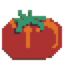

# tangentsprites

Pixel-art sprites. PNG renders are shown in the gallery below; editable
`.aseprite` sources sit alongside the PNGs where available.

## Gallery

### characters

### characters-out

### POMODORO

## Aseprite sources

- `characters.aseprite`, `POMODORO.aseprite` — sources for the PNGs above
- `tsushima.aseprite`, `island.aseprite`, `hole.aseprite`, `guy-32x32.aseprite`,
  `guy2-32x32.aseprite`, `frame.aseprite`, `egg.aseprite` — older sprites
  (source only, no PNG renders yet)
